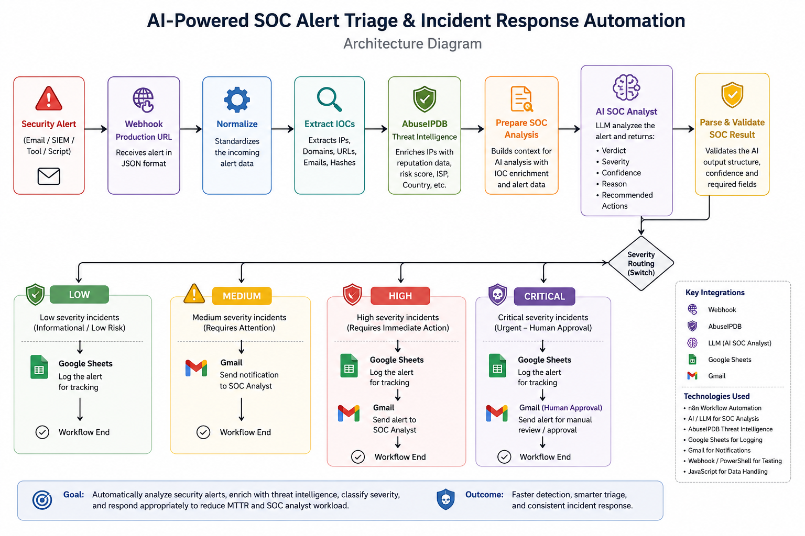

# AI-Powered SOC Alert Triage & Incident Response Automation

An AI-powered Security Operations Center (SOC) automation built with n8n. The workflow receives security alerts through a production webhook, extracts indicators of compromise (IOCs), enriches IP intelligence with AbuseIPDB, analyzes the alert using an AI SOC Analyst, validates the result, and routes the incident according to severity.

## Architecture

## Workflow

1. **Production Webhook** receives the security alert.
2. **Normalize** standardizes the incoming alert data.
3. **Extract IOCs** identifies relevant IPs, domains, URLs, emails, and hashes.
4. **AbuseIPDB** enriches IP indicators with threat-intelligence data.
5. **Prepare SOC Analysis** combines the alert and enrichment into an AI-ready context.
6. **AI SOC Analyst** returns a structured verdict, severity, confidence, reason, and recommended actions.
7. **Parse & Validate SOC Result** validates the AI response before downstream actions.
8. **Severity Routing** sends the alert to the appropriate response path.

## Severity Response

| Severity | Automated response |
|---|---|
| LOW | Log to Google Sheets |
| MEDIUM | Send Gmail notification |
| HIGH | Log to Google Sheets + Gmail notification |
| CRITICAL | Log to Google Sheets + Gmail human-approval notification |

## Key Features

- Production webhook-based alert ingestion
- IOC extraction
- Threat-intelligence enrichment with AbuseIPDB
- AI-assisted SOC triage
- Structured JSON validation
- Severity-based routing
- Google Sheets incident logging
- Gmail notifications
- Human approval path for critical incidents
- Safe investigation-oriented recommendations

## Technologies

- n8n
- JavaScript
- LLM / AI
- AbuseIPDB
- Google Sheets
- Gmail
- Webhooks
- PowerShell

## Example Alert

A safe fictional example is provided in `examples/sample-alert.json`.

## Security Notes

Credentials and API keys must be stored in n8n credentials or another secret-management mechanism. Never commit real API keys, OAuth tokens, passwords, webhook secrets, or private credentials to GitHub.

The workflow export included in this repository should be sanitized before publication.

## Testing

The workflow was tested across LOW, MEDIUM, HIGH, and CRITICAL severity paths. The production webhook was also tested successfully.

## Future Improvements

- Add additional threat-intelligence providers
- Integrate with a SIEM
- Add persistent incident tracking
- Add analyst feedback and case management
- Add automated metrics such as alert volume and mean time to triage
